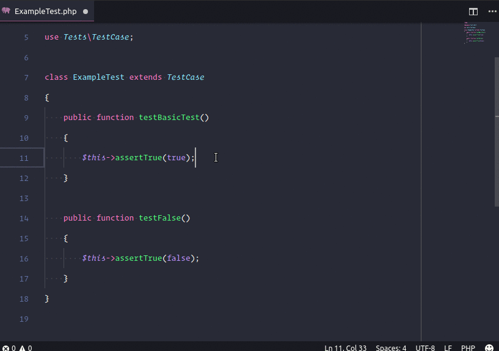
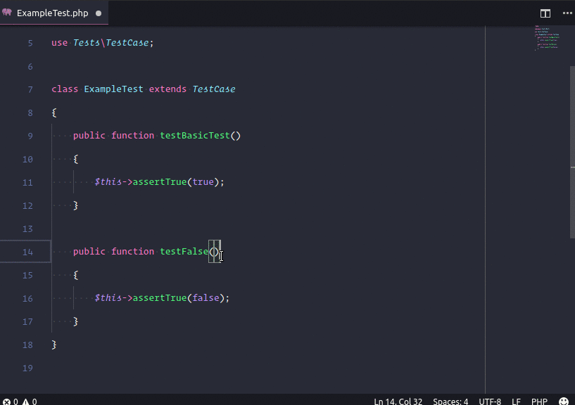
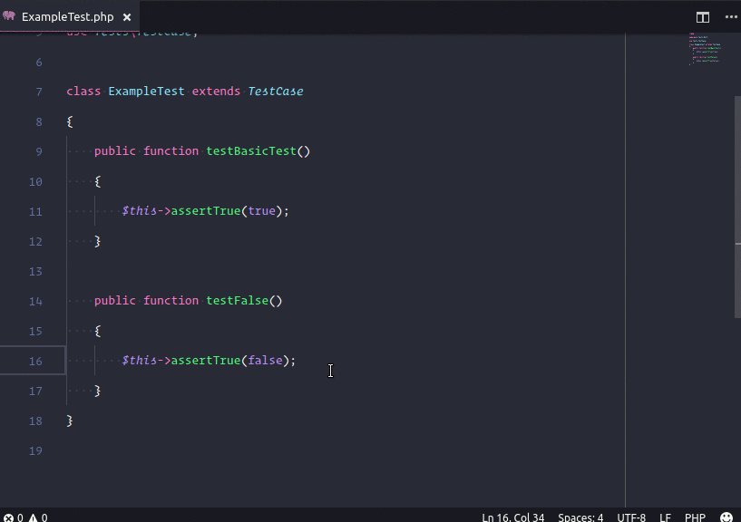
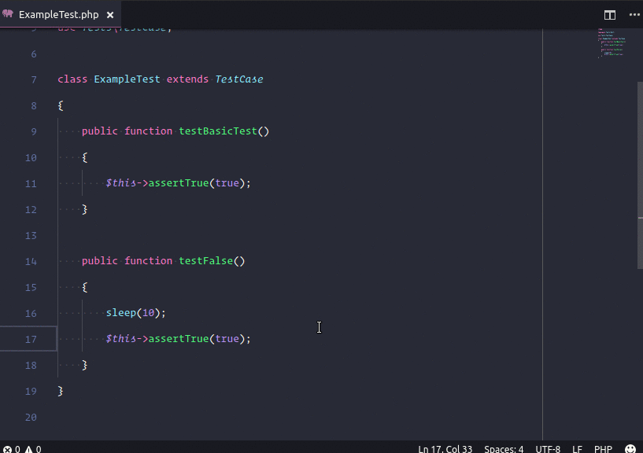

# Phpunit for VSCode
[](https://vsmarketplacebadge.apphb.com/version-short/santigarcor.phpunit-extended.svg)
[](https://vsmarketplacebadge.apphb.com/installs-short/santigarcor.phpunit-extended.svg)
[](https://vsmarketplacebadge.apphb.com/rating-short/santigarcor.phpunit-extended.svg)

## Setup
* Install [phpunit](https://phpunit.de/) or have phpunit installed through composer.
* Set the config values:
```JSON
{
    "phpunit.execPath": "path/to/phpunit", // If this value is set to '' it will try to use the composer phpunit installation.
    "phpunit.args": [
        "--configuration", "./phpunit.xml.dist"
    ],
    "phpunit.envVars": {
        // Here you can define the environment variables to be set before executing phpunit
    },
    "phpunit.excludedGroups": [
        // Groups to be excluded when running the TestSuiteWithExclusions command
    ],
    "phpunit.scriptsAfterTests": {
        "ok": [
            {
            "command": "some-command-with-args",
            "args": ["-status=ok"]
            },
            "another-command-without-args"
        ],
        "error": []
    },
    "phpunit.showOutput": "always" // always, error, ok
}
```

## How to use
Run with (`Cmd+Shift+P` on OSX or `Ctrl+Shift+P` on Windows and Linux) and execute:
* `PHPUnit Test Nearest`: This command will search the nearest function from the cursor position until the file's beginning.



* `PHPUnit Test Current File`: This command will test the current active file.



* `PHPUnit Test All Suite`: This command will run all the test suite.


* `PHPUnit Test All Suite With Exclusions`: This command will run the test suite without the excluded groups set in the configuration.

* `PHPUnit Test`: This command will show a window to pick the test to run.


* `PHPUnit Run Last Test`: This command will run the last test ran.



* `PHPUnit Cancel Current Test`: This command will cancel the current running test.



## Notes / Tips / Advanced
* **args** is recommended to set in your 'workspace settings'. You can add any phpunit args, check phpunit --help.
* To hook into the debugger ([github.com/felixfbecker/vscode-php-debug](https://github.com/felixfbecker/vscode-php-debug)). Add Key:`XDEBUG_CONFIG`, Value:`idekey=VSCODE` to your `phpunit.envVars` object.
